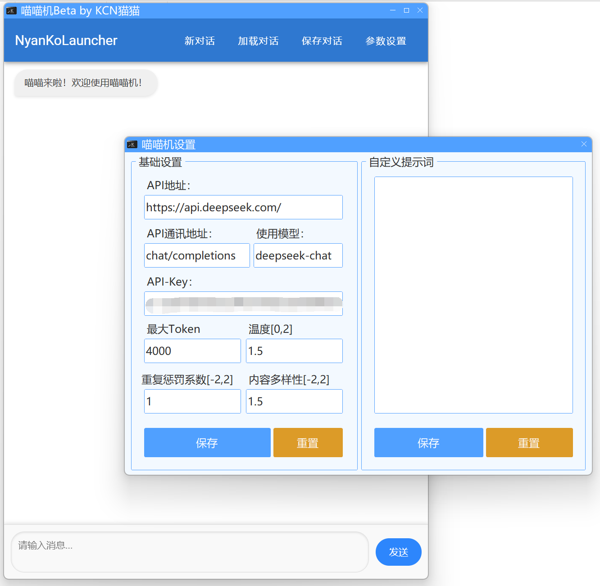

# NyanKoLauncher - 喵喵机

> **Note：** 一两天摸出来的程序质量肯定没那么好，发现Bug别骂我，提Issues就行喵

 涩涩的喵喵机，福瑞控&男同专用。
 
 **直男** 们不要下，你们用了 **会 后 悔 的**
 
 基于 `.NET7` 和 `MASA Blazor`、`WebView2`、`Winform` 等技术开发。

## 截图预览

## 下载

请前往 [Releases](https://github.com/JDDKCN/NyanKoLauncher/releases) 下载二进制分发程序。

## 使用

本程序使用 `DeepSeek-V2.5` 作为基础模型。你也可以改成别的。

- 1. 打开主程序。首次使用会弹出填写API-Key的提示。
- 2.  在此注册DeekSeep账号：[https://platform.deepseek.com/(DeepSeek开放平台)](https://platform.deepseek.com/) ，新用户注册即送500万 Tokens 额度。
- 3. 点击DeepSeek开放平台页面左侧栏中的API-Keys项，点击创建API Key，复制生成的长串字符至喵喵机设置-APIKey中，点击确定并关闭设置页面，软件自动重启。
- 4. 你可以愉快的使用喵喵机了。enjoy :)