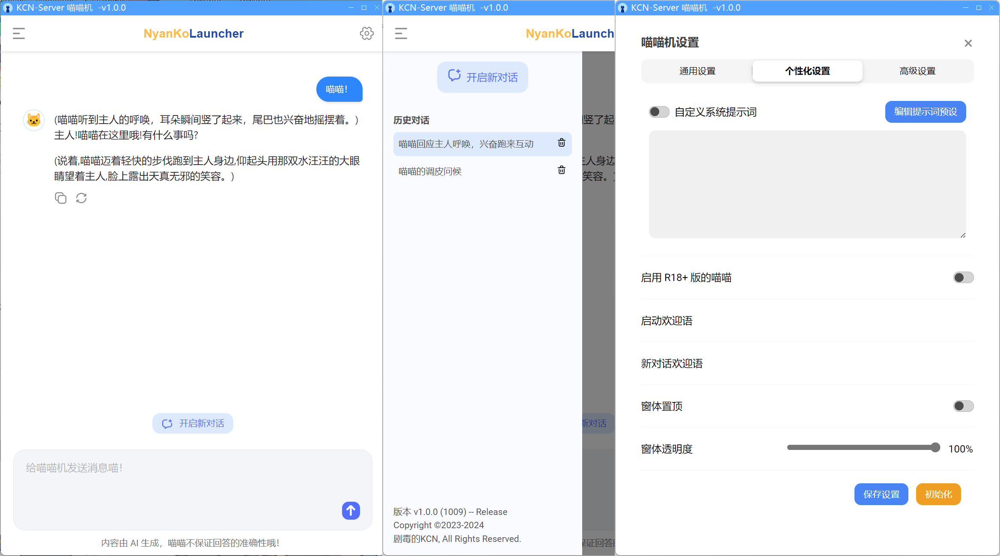

# NyanKoLauncher - 喵喵机

> **Note：** 喵喵机V1.0全新发布！具有现代界面和丰富功能，使用更方便。如有问题或建议，欢迎提出Issues喵！

 可以涩涩的喵喵机，福瑞控&男同专用。
 
 内含敏感内容，不建议 **非LGBT/Furry群体** 下载使用。
 
 基于 `.NET7` 和 `MASA Blazor`、`WebView2`、`Winform` 、`MongoDB` 等技术开发。 

## 实现功能

- 全新的现代UI。
- 通过调用API流式输出对话。支持API输出参数调节。
- LLM输出支持显示Markdown和语法高亮。
- 历史对话支持 by MongoDB。支持自定义MongoDB参数。
- 支持自定义系统提示词。支持存储和使用提示词预设。
- 其他自定义功能。启用 R18+ 版的喵喵，解除喵喵机封印！

## 截图预览

## 下载

请前往 [Releases](https://github.com/JDDKCN/NyanKoLauncher/releases) 下载二进制分发程序。

## 使用

本程序使用 `DeepSeek-V2.5` 作为基础模型。你也可以改为其他模型(例如OpenAI的模型)。

- 1. 打开主程序。首次使用会弹出填写API-Key的提示。
- 2.  在此注册DeekSeep账号：[https://platform.deepseek.com (DeepSeek开放平台)](https://platform.deepseek.com/) ，新用户注册即送500万 Tokens 额度。
- 3. 点击DeepSeek开放平台页面左侧栏中的API-Keys项，点击创建API Key，复制生成的长串字符至喵喵机设置-APIKey中，点击确定并关闭设置页面即可。
- 4. 你可以愉快的使用喵喵机了。enjoy :)